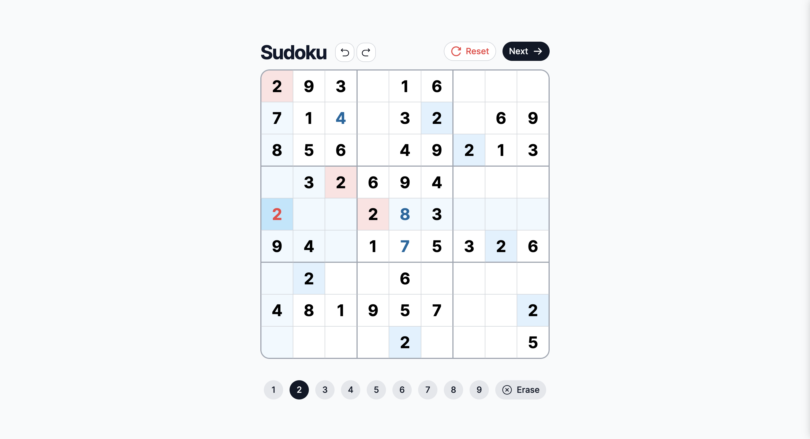

# Grid Sudoku

[](https://grid-sudoku.vercel.app)


A web-based Sudoku game built using Next.js, Tailwind CSS, and Supabase.

Deployed on Vercel at [grid-sudoku.vercel.app](https://grid-sudoku.vercel.app).

## Features



- Play **Classic Sudoku** and challenge your mind.
- Get **real-time validation** to catch any invalid moves.
- Celebrate your success when you **complete** the puzzle.
- **Undo** and **redo** moves to fix any mistakes.
- **Auto-save** your progress and pick up where you left off.
- **Choose** from 5 pre-generated Sudoku puzzles.
- Enjoy a **responsive design** that works on all devices.

## Table of Contents

- [Setup](#setup)
  - [Pre-requisites](#pre-requisites)
  - [Installation](#installation)
- [Architecture](#architecture)
  - [Components](#components)
  - [State Management](#state-management)
  - [Data Fetching](#data-fetching)
- [Future Improvements](#future-improvements)
  - [Features](#features)
  - [Accessibility](#accessibility)
  - [Optimization](#optimization)
- [Testing](#testing)
  - [Unit Tests](#unit-tests)
  - [End-to-End Tests](#end-to-end-tests)
- [Linting and Formatting](#linting-and-formatting)
- [Continuous Integration/Deployment](#continuous-integrationdeployment)
- [Appendix](#appendix)
  - [Supabase Setup Guide](#supabase-setup-guide)

## Setup

### Pre-requisites

- Node.js (v20 or higher)
- pnpm
- Supabase project

### Installation

1. Clone this repository and navigate to the project directory.

2. Install the dependencies using pnpm.

   ```bash
   pnpm install
   ```

3. Set up Supabase: Follow the [Supabase setup guide](#supabase-setup-guide), including running the provided SQL script to create and seed the `sudoku_puzzles` table.

4. Create a `.env.local` file in the root directory and add environment variables according to the [`.env.example`](.env.example) file.

5. Start the development server.
   ```bash
   pnpm dev
   ```

## Architecture

Each sudoku puzzle is stored in the Supabase database and fetched based on the `[id]` parameter in the dynamic route `/sudoku/[id]`. Server-side rendering is used for each puzzle to fetch the puzzle data and the next puzzle's id.

The puzzle is then passed to the `SudokuPage` client component, which renders the Sudoku board and handles user interactions.

### Components

- **`Board`**: The main component that renders the Sudoku board and handles user interactions.

- **`CellBox`**: Represents a single cell in the Sudoku board. It can be selected to be filled with a number. Each cell has different styles (fill/highlight/border) based on its state and coordinates. CellBox style variants are created using `class-variance-authority` and selected based on enum values.

- **`ValuePicker`**: A component that renders a number picker to select a number to fill in the selected cell or clear the cell. The buttons may be disabled based on the cell's state.

- Common UI components like `Button` and `AlertDialog` are `shadcn/ui` components found in the `@/components/ui` directory and are used throughout the app.

### State Management

- **`useSudoku()`**: Custom hook to manage the state of the Sudoku board, including the grid, filling numbers, and undo/redo history.

  - The sudoku helper utility functions are used within the hook to validate the move, check for completion, and get cell states.

  - The Command pattern is used to encapsulate state changes (cell edits, reset) as objects, to allow easy undo/redo functionality. Some commands include `CellChangeCommand` and `ResetCommand`.

  - The state is persisted in local storage to auto-save the game using the `useLocalStorage()` hook from `usehooks-ts`.

### Data Fetching

Supabase's `createServerClient()` is used to create an SSR client to fetch the Sudoku puzzles from the database.

- **`getFirstSudokuId()`**: Fetches the first Sudoku puzzle ID from the Supabase database. This is used to redirect to the first puzzle when the user visits the base `"/"` route.

- **`getSudokuById(id: string)`**: Fetches the Sudoku puzzle data and the next puzzle's id based on the given id from the Supabase database.

## Future Improvements

### Features

- Sudoku selection screen to choose from a variety of difficulty levels.
- Timer to track the time taken to complete the puzzle.
- Multiplayer mode to compete with friends or other players in real-time.

### Accessibility

- Keyboard shortcuts and navigation for selecting cells and entering numbers to improve accessibility.
- Add ARIA attributes to improve screen reader support and make the app more accessible.

### Optimization

- Use the `react-query` library to cache the fetched data and improve the performance of the data fetching.
- Explore using Web Workers to offload the computation of the Sudoku solver and improve responsiveness.
- Add Zod validation to ensure any user input is valid.
- Measure the test coverage to identify areas that need more testing.

## Testing

This project has both unit tests and end-to-end tests.

### Unit Tests

Vitest and React Testing Library are used for the unit and component tests. These tests are located in the `__tests__` directory and have the `.test.tsx` extension. They use mocks and Jest matchers to test the components, hooks and utility functions.

To run the unit tests, use the following command:

```bash
pnpm test
```

### End-to-End Tests

Cypress is used for the end-to-end tests. The tests are located in the `cypress` directory and have the `.cy.ts` extension. These tests simulate user interactions and test the app's functionality.

To run the end-to-end tests in the browser, use the following command to open the Cypress Test Runner:

```bash
pnpm cypress:open
```

You can also run the tests in headless mode using the following command:

```bash
pnpm cypress:run
```

## Linting and Formatting

This project uses ESLint and Prettier for linting and formatting. To run the linter, use the following command:

```bash
pnpm lint
```

If you want to fix the linting issues automatically, use the following command:

```bash
pnpm lint:fix
```

To fix the formatting issues, use the following command:

```bash
pnpm format
```

## Continuous Integration/Deployment

This project uses GitHub Actions for continuous integration and deployment. The unit and e2e tests are run on every push, and the app is deployed using Vercel on every push to the main branch.

## Appendix

### Supabase Setup Guide

1. Create a new project on [Supabase](https://supabase.io/).

2. Create a new `sudoku_puzzles` table on Supabase and seed some hard-coded Sudoku puzzles using the following SQL script:

```sql
CREATE TABLE "public"."sudoku_puzzles" (
    "id" uuid NOT NULL DEFAULT uuid_generate_v4(),
    "created_at" timestamp with time zone NOT NULL DEFAULT now(),
    "puzzle" text NOT NULL
);

CREATE UNIQUE INDEX sudoku_puzzles_pkey ON public.sudoku_puzzles USING btree (id);
CREATE UNIQUE INDEX sudoku_puzzles_puzzle_key ON public.sudoku_puzzles USING btree (puzzle);
ALTER TABLE "public"."sudoku_puzzles" ADD CONSTRAINT "sudoku_puzzles_pkey" PRIMARY KEY USING INDEX "sudoku_puzzles_pkey";
ALTER TABLE "public"."sudoku_puzzles" ADD CONSTRAINT "sudoku_puzzles_puzzle_key" UNIQUE USING INDEX "sudoku_puzzles_puzzle_key";

INSERT INTO "public"."sudoku_puzzles" (puzzle)
VALUES
  ('52...6.........7.13...........4..8..6......5...........418.........3..2...87.....'),
  ('837629145.4.318..2921574368.54186239163...8.7289.53416..28.56.1...241..3318967524'),
  ('634.28.15...456283528.13.6.45.397128213865.4.8..14.5.6.6.58..91381279654945631872'),
  ('.697.4123..26195.7471.5.8.693...8654.549.6..881.4.52..1.3...7.562..47.817985.1432'),
  ('293.16...71..32.69856.49213.32694......2.3...94.1.5326.2..6....481957..2....2...5')
;
```

If you ever need to reset your Supabase database, you can use this to drop the `sudoku_puzzles` table:

```sql
DROP TABLE "public"."sudoku_puzzles";
```
